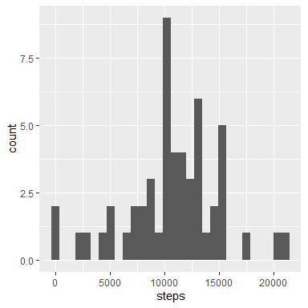
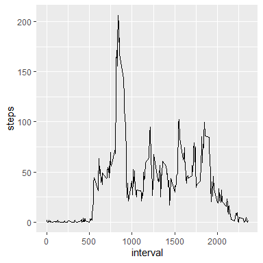
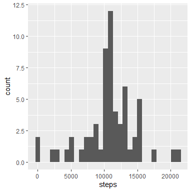
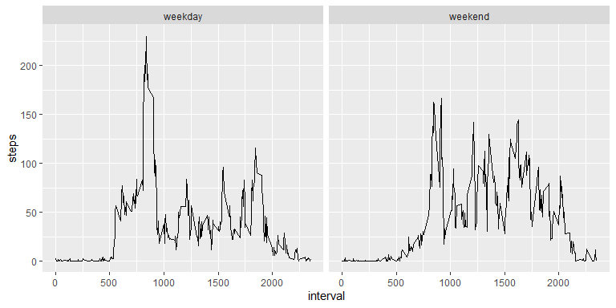

## Loading and preprocessing the data

The data in this analysis is data from a personal activity monitoring device. It consists of the date, the amount of steps and the time interval in which the steps were measured.
In the following step the data is loaded and the date is transformed to date format from a character format.


```r
df <- read.table("./activity/activity.csv",sep=",",na.strings="NA",header = TRUE)
df$date <- as.Date(df$date, "%Y-%m-%d")
```


## What is mean total number of steps taken per day?

The following code calculates the total number of steps for each day. The plot shows the result.


```r
total_steps <- aggregate(steps~date,data=df,sum)

ggplot(total_steps)+
  geom_histogram(aes(steps))
```

```
## `stat_bin()` using `bins = 30`. Pick better value with `binwidth`.
```

<!-- -->

The mean and median steps for each day are calculated.


```r
mean(total_steps$steps)
```

```
## [1] 10766.19
```

```r
median(total_steps$steps)
```

```
## [1] 10765
```


## What is the average daily activity pattern?

The average daily activity pattern is obtained by calculating the average for each interval across all days.
The maximum amount of steps are taken from this calculation.


```r
mean_steps_by_interval <- aggregate(steps~interval,data=df,mean)
mean_steps_by_interval$interval[which.max(mean_steps_by_interval$steps)]
```

```
## [1] 835
```

```r
ggplot(mean_steps_by_interval)+
  geom_line(aes(interval,steps))
```

<!-- -->


## Imputing missing values

The missing values in the steps variable are replace by the average steps for the concerning time interval. 


```r
sum(complete.cases(df))
```

```
## [1] 15264
```

```r
df_i <- df
na_pos <- which(is.na(df_i$steps))
df_i$steps[na_pos] <- mean_steps_by_interval$steps[match(df_i$interval[na_pos],mean_steps_by_interval$interval)]
```

# Total steps
With the imputed data, the total steps are calculated and plotted.

```r
total_steps_i <- aggregate(steps~date,data=df_i,sum)

ggplot(total_steps_i)+
  geom_histogram(aes(steps))
```

```
## `stat_bin()` using `bins = 30`. Pick better value with `binwidth`.
```

<!-- -->

# Mean and median steps

The mean and median steps on each date is calculated with the imputed data set as well. 

```r
mean(total_steps_i$steps)
```

```
## [1] 10766.19
```

```r
median(total_steps_i$steps)
```

```
## [1] 10766.19
```

## Are there differences in activity patterns between weekdays and weekends?


To the imputed data set a new column is added, indicating if the date is a weekday or not.
Using this column, the mean steps across time intervals and the categories weekday/weekend are calculated and plotted.

```r
df_i$days <- weekdays(df_i$date) %in% c("Saturday","Sunday")
df_i$days <- c("weekend","weekday")[match(df_i$days,c(TRUE,FALSE))]
df_i$days <- factor(df_i$days)

mean_per_days <- aggregate(steps~days+interval,data=df_i,mean)

ggplot(mean_per_days)+
  geom_line(aes(x=interval,y=steps))+
  facet_wrap(~days)
```

<!-- -->
